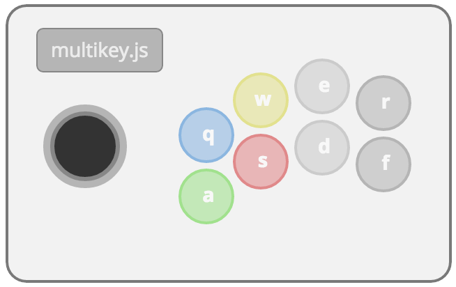

# multikey.js
-----------
##introduction
**multikey.js** is a small script that enables keypress event binding and integrates nicely to other libraries and can be used to extend your interactive canvas or html5 games.

### design pattern
**multikey.js** is built on a revealing module pattern exposing four (4) core methods.

* setup()
* bind()
* unbind()
* handler()

### usage
**multikey.js** is an IIFE *(immediately-invoked function expression)* simply include the file at the bottom of your html page before the closing ***body*** tag

<pre>
	/*
	** @description include mutlikey.js or mutlikey.min.js
	*/
	&lt;script src="mutlikey.min.js"&gt;&lt;/script&gt;
&lt;/body&gt;
</pre>

####*setup()*
Once you have included the multikey.js file, you can invoke the process by calling the setup method. Setup can take from 1 to 3 parameters. *cbfunc* is required


#####With a callback function
```
/*
@param cbfunc {function} callback function to recieve the map object from multikey.js
*/
setup(cbfunc)
```
What is returned to the ***cbfunc*** is an object with the character key as the property and the value will be either **true** *(pressed)* or **false** *(released)*

example:

```
{
	q:false,
	w:true,
	e:true,
	r:false
}
```
do whatever you wish with the returned object within your callback function

#####With key set restrictions
```
/*
@param cbfunc {function} callback function to recieve the map object from multikey.js
@param keys {string} this is a string of keyboard keys to create a limited set, unset, all keys are recorded
@description keys parameter examples "abc", "qwer", "wasd"
*/
setup(cbfunc, keys)
```

#####With arrow keys
```
/*
@param cbfunc {function} callback function to recieve the map object from multikey.js
@param keys {string} this is a string of keyboard keys to create a limited set, unset, all keys are recorded
@description keys parameter examples "abc", "qwer", "wasd"
@param arrows {boolean} if set to true, multikey.js also watches the arrow keys on a keyboard
*/
setup(cbfunc, keys, arrows)
```


##example
----------
Below is a quick screengrab of the script running once the user allows the sharing of their camera *(yep, it's a pitcure of me)*



view the [example](index.html) file for more information.
or check out the [live example](http://multikey.32teeth.org/) here


